<h1 align="center">Hi 👋, I'm Soheab</h1>
<h3 align="center">A passionate Junior Software Developer</h3>

I am a backend Junior Software Developer and have been programming since 2017. My focus is on building reliable backend systems and APIs that are logically structured, maintainable, and scalable. My main experience is with Python, PHP, and JavaScript, especially backend logic, data, and integrations. I am also interested in AI development and enjoy working with databases, clean structure, error handling, and performance.

I learn quickly, think analytically, and like solving technical problems beyond the surface level. In my projects, I aim for solutions that stay simple while remaining technically correct and future-proof. I actively work on personal and open-source projects to keep improving my development skills.

  
  
  
  

  
  

<h3 align="center">Projects</h3>

My featured projects are pinned on my GitHub profile. You can also see more of my work on <a href="https://soheab.com" target="_blank" rel="noreferrer">soheab.com</a>.

<h3 align="center">Languages and Tools</h3>

         

<h3 align="center">Statistics</h3>

  

  
  
  

