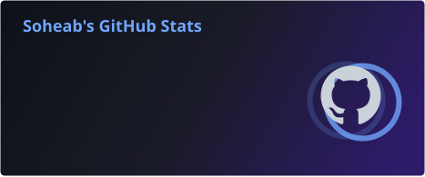
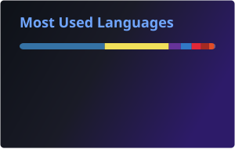
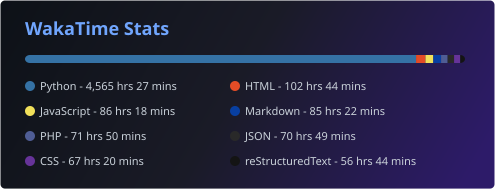

<h1 align="center">Hi 👋, I'm Soheab</h1>
<h3 align="center">Junior Software Developer</h3>

  
  
  
  
  
  

Software developer since 2017, focused on building reliable, maintainable APIs and integrations with Python, PHP, JavaScript, and databases. I mostly work on Discord-related projects—using and abusing its API—while also exploring open-source software and AI development.

Projects: <a href="https://github.com/Soheab" target="_blank" rel="noreferrer">GitHub</a> · <a href="https://soheab.com" target="_blank" rel="noreferrer">soheab.com</a>

<h3 align="center">Discord Activity</h3>

  
  
  
  
  

<h3 align="center">Languages and Tools</h3>

  

<h3 align="center">Statistics</h3>

  

  
  
  

